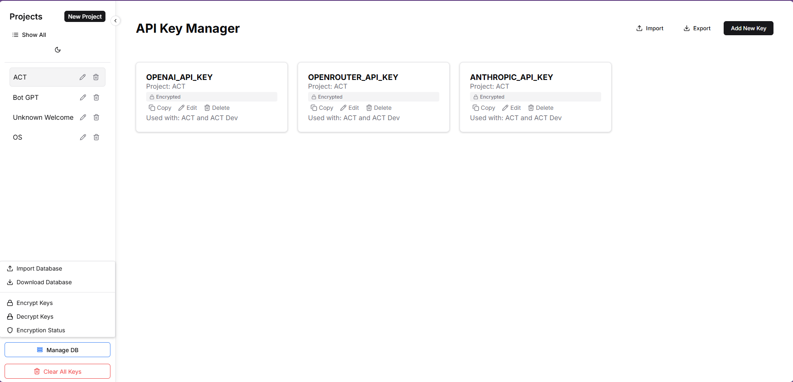

# API Key Manager



A Flask-based web application for managing and organizing API keys with a modern, responsive interface. This application helps developers and teams keep track of their API keys, organize them by projects, and maintain a secure central repository of API credentials.

## Features

- **API Key Management**
  - Store and organize API keys with descriptions and usage information
  - Copy keys to clipboard with one click
  - Secure storage of API credentials
  - Add descriptions and "used with" information for each key

- **Project Organization**
  - Group API keys by projects
  - Drag-and-drop interface for organizing keys
  - Reorder keys within projects
  - Move keys between projects

- **Modern UI/UX**
  - Responsive design that works on all devices
  - Dark/Light theme support
  - Collapsible sidebar for better space utilization
  - Drag-and-drop interface for easy organization
  - Real-time updates
  - Theme persistence across sessions
  - One-click copy to clipboard for API keys
  - Collapsible sidebar with state persistence
  - Interactive notifications for bulk actions
  - Drag-and-drop reordering within projects
  - Drag-and-drop between projects for key organization
  - Modern toast notifications for actions
  - Responsive grid layout for key cards

- **Security & Logging**
  - Comprehensive logging system
  - Secure storage of API keys
  - Error handling and validation
  - Database backup support
  - Detailed error logging to api_key_manager.log
  - Automatic database transaction rollback on errors
  - Input validation for all API endpoints
  - File encoding validation (UTF-8)
  - Secure file upload handling
  - Automatic key name conflict resolution
  - Database migration error handling
  - Comprehensive error messages for debugging

- **Import/Export Capabilities**
  - Import API keys from multiple file formats:
    - .env files
    - JSON files
    - YAML files
    - Properties files (.properties)
    - Configuration files (.conf, .config)
  - Export API keys to:
    - .env format
    - JSON format
    - YAML format
  - Bulk import configuration with post-import customization
  - Support for various .env file formats including:
    - KEY=value
    - KEY = value
    - KEY: value
    - export KEY=value
    - KEY='value'
    - KEY="value"
    - Comments support (# or ; prefixed lines)

- **Bulk Operations**
  - Set descriptions for multiple keys at once
  - Apply "Used with" information to multiple keys simultaneously
  - Clear descriptions for multiple keys
  - Delete all keys in a project
  - Batch update key configurations after import

## Prerequisites

- Python 3.7+
- pip (Python package manager)
- SQLite3

## Installation

1. Clone the repository:
```bash
git clone https://github.com/Eplisium/API-Storage.git
cd API-Storage
```

2. Create and activate a virtual environment:
```bash
# On Windows
python -m venv venv
venv\Scripts\activate

# On macOS/Linux
python -m venv venv
source venv/bin/activate
```

3. Install dependencies:
```bash
pip install -r requirements.txt
```

4. Initialize the database and run migrations:
```bash
flask db init
flask db migrate -m "Initial migration"
flask db upgrade
```

## Configuration

The application uses a simple configuration setup with the following defaults:

- Database: SQLite (`keys.db` in the application directory)
- Server: Runs on `localhost:5000`
- Logging: Configured via `logging.conf`, outputs to `api_key_manager.log`

To modify these settings, you can edit the following files:
- `app.py`: Database URL and application settings
- `logging.conf`: Logging configuration

## Running the Application

1. Start the Flask development server:
```bash
python app.py
```

2. Access the application at `http://localhost:5000`

## API Endpoints

### Keys

- `GET /keys` - List all keys
  - Query parameters:
    - `project_id`: Filter keys by project
    - `show_all`: Show all keys including those in projects

- `GET /keys/<id>` - Get a specific key
- `POST /keys` - Create a new key
  ```json
  {
    "name": "API Key Name",
    "key": "your-api-key",
    "description": "Optional description",
    "used_with": "Service name",
    "project_id": null
  }
  ```
- `PUT /keys/<id>` - Update a key
- `DELETE /keys/<id>` - Delete a key
- `PATCH /keys/<id>/project` - Update key's project
- `PATCH /keys/<id>/reorder` - Reorder key within project

### Projects

- `GET /projects` - List all projects
- `POST /projects` - Create a new project
  ```json
  {
    "name": "Project Name"
  }
  ```
- `PUT /projects/<id>` - Update a project
- `DELETE /projects/<id>` - Delete a project

## Development

### Database Migrations

The application uses Flask-Migrate for database migrations:

1. Create a new migration after model changes:
```bash
flask db migrate -m "Migration message"
```

2. Apply migrations:
```bash
flask db upgrade
```

### Checking Database Status

Use the built-in database check command:
```bash
flask check-db
```

## Security Considerations

1. The application is designed for local use or internal networks
2. The default configuration uses hardcoded values suitable for development
3. For production deployment:
   - Change the secret key in `app.py`
   - Implement proper authentication
   - Use HTTPS if exposed to the internet
   - Consider using environment variables for sensitive data
4. Regularly backup the SQLite database file

## Browser Compatibility

- Chrome 80+
- Firefox 75+
- Safari 13+
- Edge 80+

## Contributing

1. Fork the repository
2. Create a feature branch
3. Commit your changes
4. Push to the branch
5. Create a Pull Request

## License

This project is licensed under the MIT License - see the LICENSE file for details.

## Troubleshooting

### Common Issues

1. Database initialization errors:
   - Ensure SQLite is installed
   - Check write permissions in the application directory
   - Run `flask db init` if this is a fresh installation
   - Check `api_key_manager.log` for detailed error messages

2. Key management issues:
   - Check the logs in `api_key_manager.log`
   - Verify database connectivity
   - Ensure proper JSON format in API requests

3. UI issues:
   - Clear browser cache
   - Check browser console for errors
   - Verify all static files are being served correctly

4. Migration issues:
   - If you get "No such table" errors, ensure you've run all migrations
   - For fresh installations, run the full migration sequence:
     ```bash
     flask db init
     flask db migrate -m "Initial migration"
     flask db upgrade
     ```